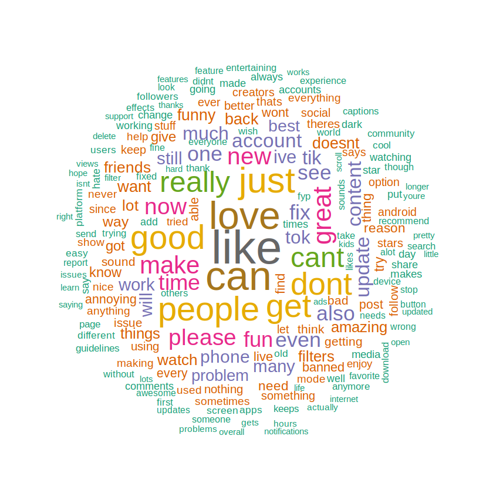
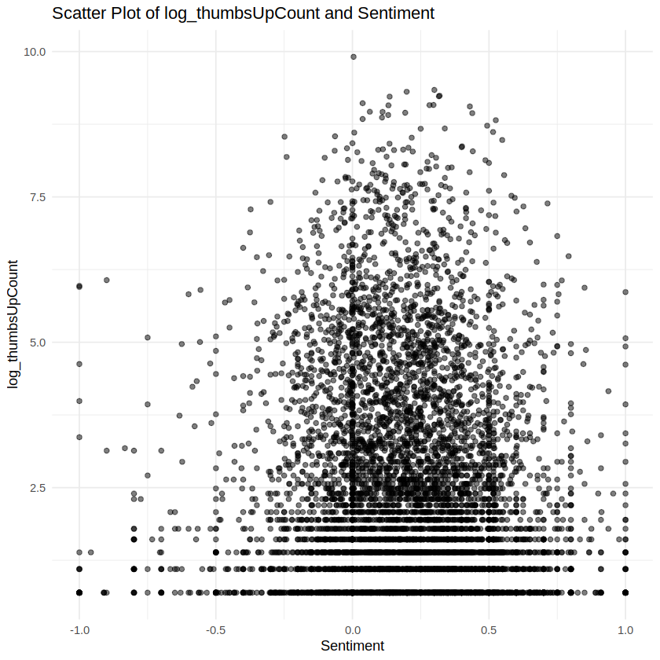

# TikTok Google Play Reviews: Sentiment Analysis (Python + R)

Sentiment analysis of public attitudes toward TikTok using **307,057 Google Play reviews**, combining Python NLP preprocessing with econometric regression analysis in R.

## Pipeline

1. **Data cleaning (Python)** -- `tiktok_sentiment_data_cleaning.ipynb`
   Language detection (langdetect), emoji handling, text normalization, and TextBlob sentiment scoring of raw review text.
2. **Regression analysis (R)** -- `tiktok_regression_analysis_R.ipynb`
   OLS, fixed-effects (by TikTok app version, controlling for unobserved heterogeneity), and omitted-variable-bias models on the processed data, with stargazer regression tables.

## Key Result

- Positive-sentiment comments show a **6.4% higher thumbs-up probability**, robust across OLS and fixed-effects specifications

## Data

Publicly available TikTok Google Play reviews dataset (307K rows). Raw data not included in this repository due to size; the cleaning notebook reproduces the processed dataset from the source CSV.

## Tech Stack

Python (pandas, TextBlob, langdetect, emoji), R (tidyverse, plm fixed effects, lmtest, stargazer, wordcloud)
